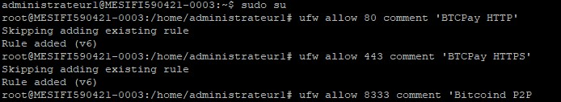
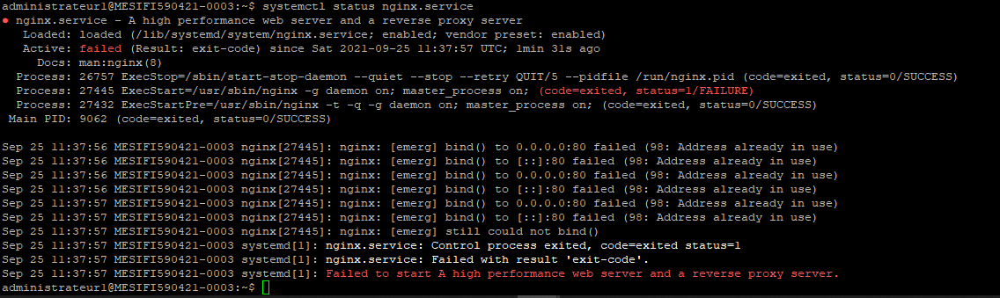
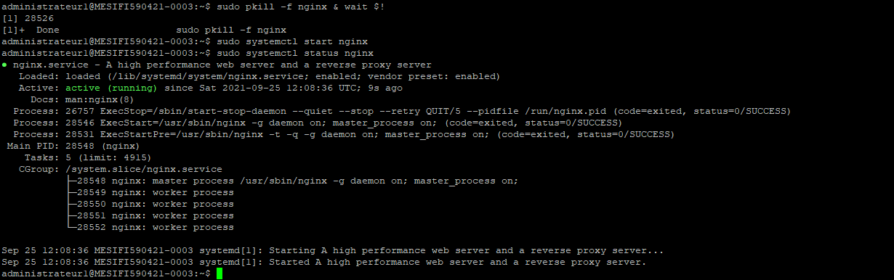
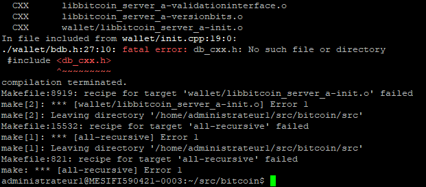
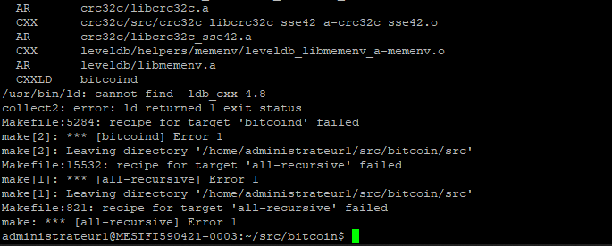
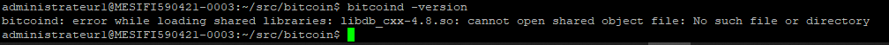

# TD 2 Monaie Numerique

## Install all dependencies

``sudo apt install ufw``

``sudo apt install fail2ban``

``sudo apt install iptables-persistent``

``sudo apt install postgresql postgresql-contrib``

``sudo apt install tor``

``sudo apt install nginx``

``sudo apt install certbot python3-certbot-nginx``

``sudo apt install build-essential libtool autotools-dev automake pkg-config bsdmainutils python3``

``sudo apt install libevent-dev libboost-system-dev libboost-filesystem-dev libboost-test-dev libboost-thread-dev libminiupnpc-dev libzmq3-dev``

## Adapt UFW config

En suivant le tutoriel, nous avons ajouté dans la config UFW la liste des ports qui étaient dans le tutoriel enregistré dans `iptable.txt` avec la commande ``ufw allow <port number> comment 'comment'``.




## Adapt SSH config

## NGINX

Après avoir ajouté et modifié le fichier de configuration nginx en ajoutant notre nom de domaine il se peut qu'au moment de vouloir relancer le système une erreur survient :



Pour résoudre ce problème et si ``sudo journalctl -xe --unit nginx`` ne fonctionne pas non plus, rien de compliqué il suffit d'arrêter le process ``sudo pkill -f nginx & wait $!`` et de le relancer avec start.



## Bitcoin Daemon

On continue de suivre le tutoriel mais en selectionnant la version *bitcoin-core-22.0*.

En voulant générer les fichiers make avant de build on reçoit l'erreur suivante que l'on peut corriger en installant la librairie **libdb++-dev**.



En relançant la commande "**make**" on rencontre cette fois encore une erreur :



Cette fois le package *db_cxx* n'est pas trouvé, on tente donc de l'installer d'une autre manière.

```
wget http://download.oracle.com/berkeley-db/db-4.8.30.zip
unzip db-4.8.30.zip
cd db-4.8.30
cd build_unix/
../dist/configure --prefix=/usr/local --enable-cxx
make
sudo make install
```

Cette fois **make** semble aller au bout sans encombre, de même pour "**sudo make install**".

Toutefois en voulant vérifier que bitcoind s'est bien installé on se retrouve à nouveau confronté à une erreur impliquant une fois encore la librairie *db_cxx*.



## Install BTC Pay server

## Configure your BTC pay server

## Install website / Wordpress

## Create a button to pay with tBTC

## Create a button to pay with lightning

